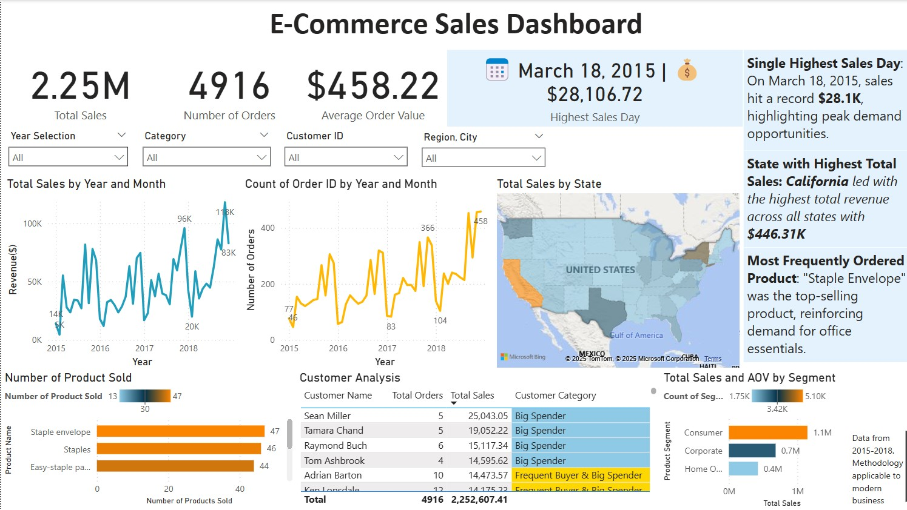

# 📊 E-Commerce Sales Dashboard - Power BI Analytics

## 📌 Project Overview

This project showcases an **interactive Power BI dashboard** analyzing e-commerce sales data from **2015-2018**. The dashboard provides business insights into **revenue trends, customer behavior, and top-performing products**, helping stakeholders make data-driven decisions.

**🔹 Tech Stack:** Power BI, Python (Data Cleaning), DAX

---

## Dashboard Preview



🔹 **Click **************[**here**](Dashboard_Screenshots/)************** for more dashboard images.**


---

## Dataset Overview

- **Source:** [**Superstore**](https://www.kaggle.com/datasets/rohitsahoo/sales-forecasting) Sales Data from Kaggle
- **Time Range:** 2015-2018
- **Columns:** Order Date, Sales, Customer Name, Region, Category, Product Name, Order ID, etc.

### **Key KPIs Tracked:**

- **Total Sales** 
- **Number of Orders** 
- **Average Order Value (AOV)** 
- **Top Customers (Frequent Buyers & Big Spenders)** 
- **Most Sold Product** 
- **Sales by State (Geographic Analysis)** 

---

## Business Insights & Data Storytelling

🔹 **California** had the highest total sales (**\$446.31K**), making it the top-performing state.\
🔹 **March 18, 2015**, saw the highest single-day sales at **\$28.1K**, highlighting peak demand opportunities.\
🔹 **"Staple Envelope"** was the most purchased product, reinforcing strong demand for office essentials.

---

## Interactive Features & Filters

🔹 **Year, Region, and Customer Filters** allow users to dynamically explore trends.\
🔹 Clicking on a **state in the map** updates revenue trends for that region.\
🔹 Customer segmentation categorizes buyers into **Frequent Buyers, Big Spenders, and Elite Customers** based on order count & sales volume.

---

## How to Use This Project

### **Steps to View the Dashboard:**

1. **Download the **************\`[**Ecommerce_KPI_Dashboard.pbix**](Ecommerce_KPI_Dashboard.pbix)\`************** file** from this repository.
2. Open it in **Power BI Desktop**.
3. Use filters and interactive charts to explore insights.

### **🔹Report PDF:**
[**View the Power BI Report PDF**](Ecommerce_KPI_Dashboard.pdf)

---

## 📂 Repository Structure

```
📂 Ecommerce-Sales-Dashboard
│── 📂 DAX_Queries/                  # DAX queries used in Power BI 
│── 📊 Dashboard_Screenshots/      # Folder for Dashboard Screenshots
│── 📊 Dataset/                      # Folder for the dataset, original and cleaned
│── 📂 Python_Notebook/              # Data Cleaning Scripts
│── 📄 Ecommerce_KPI_Dashboard.pbix # Power BI file  
│── 📄 README.md                    # The documentation file
```

---

## 📬 Contact Information
🔹 **LinkedIn:** [LinkedIn Profile](https://www.linkedin.com/in/siddharth-gosawi)\
🔹 **Email:** [siddharth.gosawi@gmail.com](mailto\:siddharth.gosawi@gmail.com)

📌 *Feel free to reach out for collaboration or discussions!*

